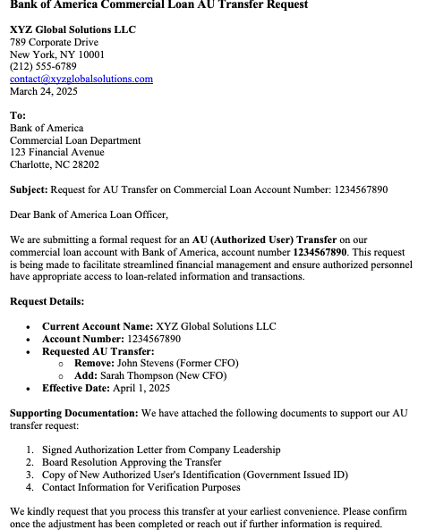
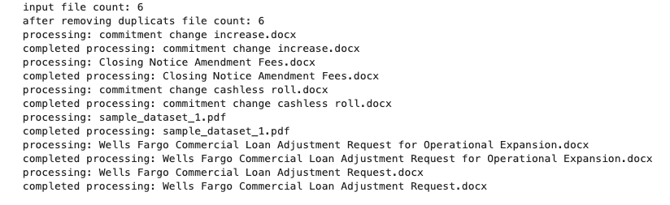

# Project Name
Technology Hackathon - Get AI Orchestrator for Email and Document Triage Routing

## Table of Contents
- [Introduction](#introduction)
- [Features](#features)
- [Benefits](#benefits)
- [Demo](#demo)
- [Inspiration](#inspiration)
- [What It Does](#what-it-does)
- [How We Built It](#how-we-built-it)
- [Challenges We Faced](#challenges-we-faced)
- [How to Run](#how-to-run)
- [Tech Stack](#tech-stack)
- [Team](#team)

---
## Introduction
The project provides a solution to automate email classification and data extraction using Genrative AI (LLMs) to improve the efficiency, accccuracy and trunaround time for Commercial Bank Lending Service service requests. This solution utilizes Generative AI (ChatGPT LLMs) to automate the classification of incoming service requests and the extraction of key data points from email content for Commercial Bank Lending Services. The goal is to streamline operations, reduce manual workloads, enhance accuracy, and improve turnaround time for handling customer requests.

## Features
The provided soution supports below given list of features.

1. Reads and interprets the email content and attachments. Removes teh duplicate requests/file based on content.
2. Automatically categorize incoming emails related to commercial lending services (e.g., Adjustment, AU Transfer, Closing Notice, etc.). Identifies the intent of the email and classify the "Request Type" and "Sub Request Type".
3. Extracts key attributes  such as loan amounts, customer names, document types, and other key information from email bodies.
4. Supports emails and attachements of various tupes such as text, docx, pdf and images.

##  Benefits
The provided soution offers below given list of benefits.

1. Efficiency: Automatic processing of emails accelerates response times and reduces the burden on support teams.
2. Accuracy: Generative AI models like ChatGPT are trained on vast datasets, improving the quality of email classification and data extraction.
3. Cost-Effectiveness: Reduces operational overhead by minimizing manual intervention and operational inefficiencies.
4. Scalability: The solution can scale with increasing volumes of service requests and emails. It is developed using asynchrous processing APIs to process incoming requests and files parallely.

##  Demo
[Live Demo](#) (if applicable)  
[Video Demo](#) (if applicable)  
Screenshots:
Sample Email:


Execution Log:



## Inspiration
Commercial Bank Lending Service teams receive a significant volume of service requests through emails. These emails contain diverse requests, oftne with attachments and will be ingested into laon servicing platform. This involves lot of manual steps to segregate the request into categories and process the context. This problem can be automated using LLM models which understands the semantic meaning of the service requests and can process the requests with minimal intervention. This solution can further enhanced to automate the responses and actions to service requests.

## What It Does
This solution uses python program with chat gpt LLM model based on predefined prompts. It will read the contents of the emails and attachments and understand the context of the emails in the lending domain context. Use the processed context to classify emails and to extract important data attrbutes from the emails and attachments.

##  How We Built It
We have build it using python, chat gpt and other opensource packages avaiable for file processing.

## Challenges We Faced
Identifying a model that classisy the requests consistently. LLM requires a prompt to explain the problem statement in a generic manneric at the same time to suit the business domain. TWe have explored multipl prompts to ensure the model understannds the problem context correctly.
Some times the email are not straight forward and be vague. LLMs helped in this aspect of understanding the user's intent and the service request.
When processing large file LLMs can take more time to process the data. To address this we have used asynchronous processing to process incoming reuqests parallely.
Email requests from users can be duplicate, hence we have added logic to remove dupliate requests.

## How to Run
1. Clone the repository  
   ```sh
   git clone https://github.com/ewfx/gaied-innovators
   ```
2. Install dependencies  
   ```sh
   !pip install openai langchain_openai pdfplumber pytesseract pdf2image python-docx fpdf langchain
   ```
3. Run the project  
   ```sh
   python LLM-MailOps.py
   ```

##  Tech Stack

Python: Core language for the business logic.

OpenAI GPT-4 (ChatGPT): gpt-4o-mini model used for natural language processing (NLP) tasks such as email classification and data extraction.

## Team
- **Jayprakash Mahankali** 
- **Ashok Nagabandi** 
- **Prathap Reddy Chitam** 
- **Bibaswan Padhy** 
